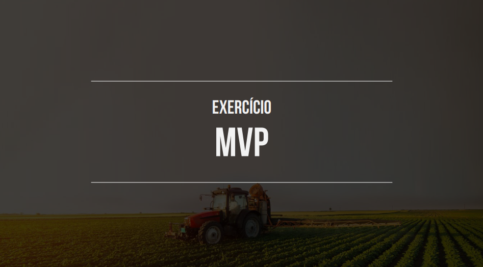
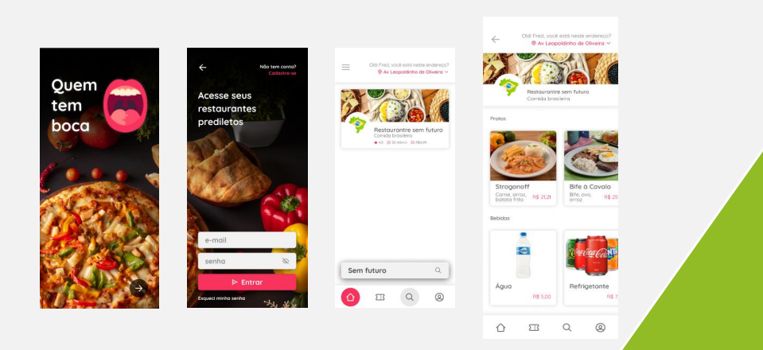

<h1 align="center">Exercício Técnico – FULL STACK</h1>

  

  <a href="#-sobre">Sobre</a>&nbsp;&nbsp;&nbsp;|&nbsp;&nbsp;&nbsp;
  <a href="#-projeto">Projeto</a>&nbsp;&nbsp;&nbsp;|&nbsp;&nbsp;&nbsp;
  <a href="#-tecnologias">Tecnologias</a>&nbsp;&nbsp;&nbsp;|&nbsp;&nbsp;&nbsp;
  <a href="https://api-restaurant-scxy.onrender.com/documentation/">Documentação Backend</a>&nbsp;&nbsp;&nbsp;|&nbsp;&nbsp;&nbsp;
  <a href="#-autor">Autor</a>

## ✨ Sobre

Projeto desenvolvido no desafio tecnico para vaga de Full Stack na empresa [Grão Direto](https://www.graodireto.com.br/).
Informações do desafio:

Suponha que você tenha sido solicitado a desenvolver uma plataforma no ramo de gastronomia. O cliente solicitou um MVP para validar seu conhecimento, 
com as seguintes características:

- Um portal WEB responsivo ou aplicativo mobile;
-  Autenticação por e-mail e senha criptografados;
- Tela inicial com uma lista dos restaurantes;
- A tela deve possuir um campo de busca livre, que filtra os restaurantes cujo NOME DO RESTAURANTE, NOME E DESCRIÇÃO DO PRATO possuam os caracteres digitados;
- Ao clicar em um restaurante na lista, a plataforma deve ir para a tela de detalhe do restaurante e cardápio;
- Tela com detalhe do restaurante, mostrando nome, telefone e endereço, além da lista de itens do cardápio (nome, descrição e preço)

Desenvolva o MVP solicitado, em qualquer tecnologia, respeitando os seguintes critérios: 

- Portal ou aplicativo; 
- Tela de login e autenticação (criar um usuário "fred@graodireto.com.br e senha "123Fred"); 
- Backend respondendo a chamadas API REST; 
- Repositório de dados contendo informações dos usuários, restaurantes e itens do cardápio;

<h2 align="center">Abaixo está o exemplo enviado no desafio</h2>

  

## ✨ Projeto
<!-- 

  

 -->

<h3 align="center">O projeto foi desenvolvido usando a MERN STACK, abreviação para MongoDB, Express, React, e Node.js</h3>

  

### Banco de dados

 

Foi utilizado o Mongo Atlas, que alem de ser o banco MongoDB ele já fica em nuvem, facilitando acesso ao mesmo.

### Backend

 

- [Backend](https://github.com/diegohfcelestino/desafio-tecnico-fullstack-graoDireto/tree/main/api-restaurante)
  
O backend foi desenvolvido utilizando NodeJS, Express e o JWT para proteção de rotas. O projeto foi publicado no Rende, plataforma para fazer deploy com Node e nelepossui as seguintes requisições/end points:

- Criar usuário, alterar, buscar todos os usuário e buscar um usuário por ID.
- Autenticação,
- Cadastrar restaurante e buscar todos os restaurantes.
- Cadastrar cardápio vinculando um restaurante, buscar todos os cardápios, buscar cardápio por ID.
- Buscar os cardápios por ID de um restaurante e apagar cardapios.

Foi criada a documentação de todos os end points pelo [Swagger](https://api-restaurant-scxy.onrender.com/documentation/), já com exemplos para utilizar e implantar o back end, e também está publicada.

### Mobile  

   

- [Mobile](https://github.com/diegohfcelestino/desafio-tecnico-fullstack-graoDireto/tree/main)

## 🧪 Tecnologias

- [Nodejs](https://nodejs.org/en/)
- [Express](https://expressjs.com/pt-br/)
- [React-native](https://reactnative.dev/)
- [Javascript](https://www.javascript.com/)
- [MongoDB](https://www.mongodb.com/)
- [MD5](https://www.md5hashgenerator.com/)
- [JWT](https://jwt.io/)
- [Axios](https://axios-http.com/ptbr/docs/intro)
- [Render](https://dashboard.render.com/)
  

O projeto pode ser clonado e executado localmente.

## ✨ Autor

Feito com amor por **Diego Henrique Ferreira Celestino** seguindo o desafio técnico.
Entre em contato!

