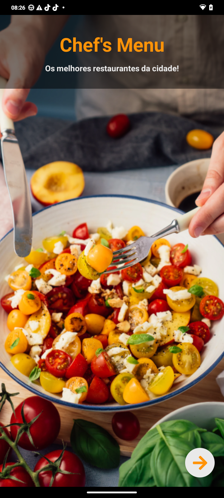
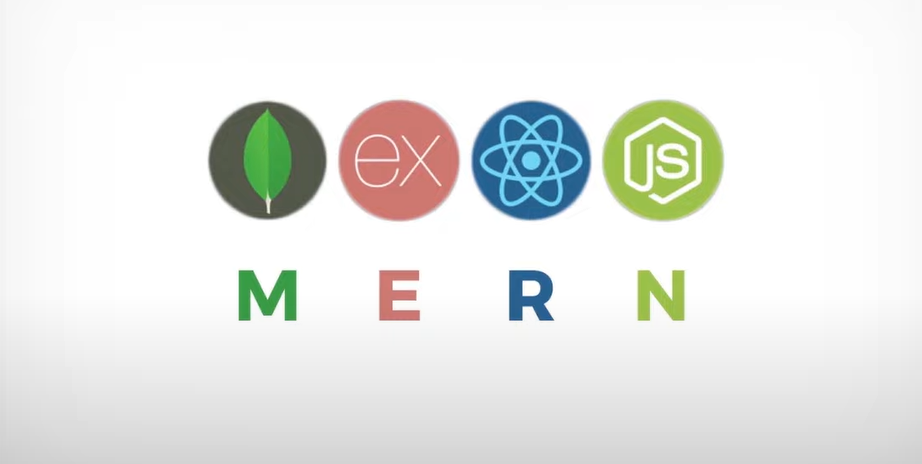
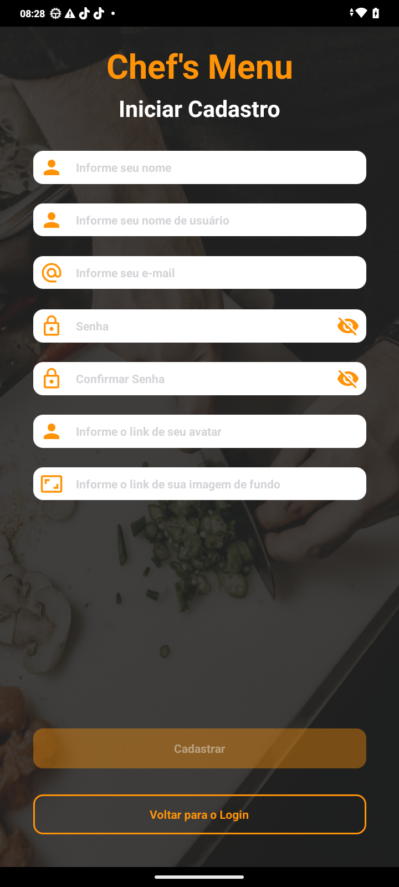
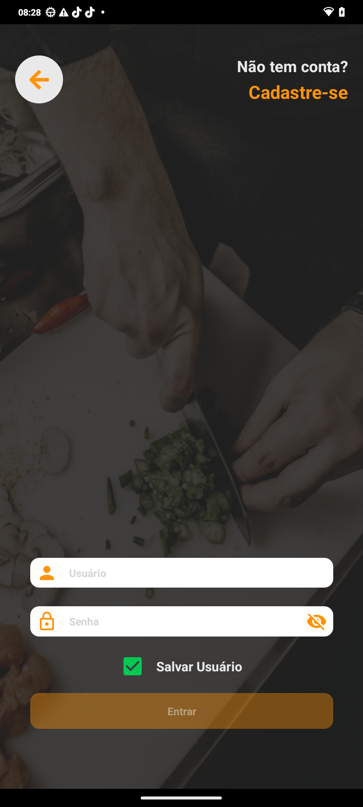
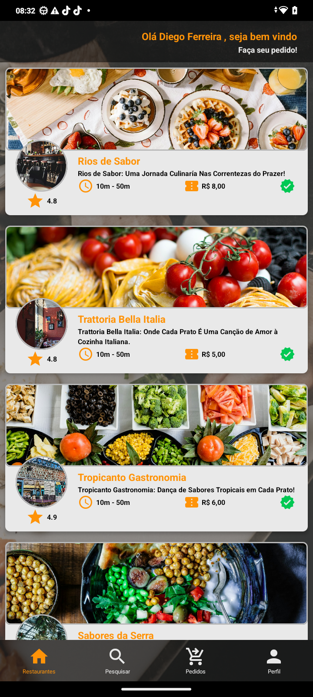
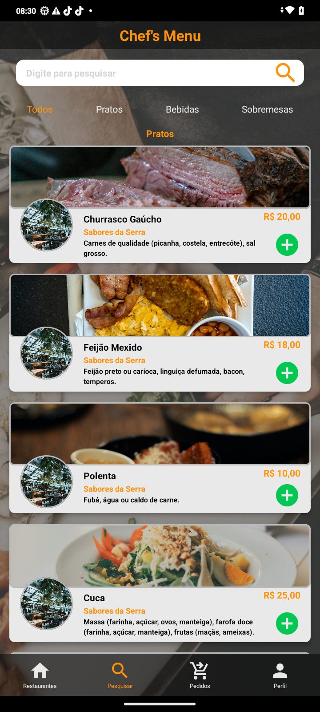
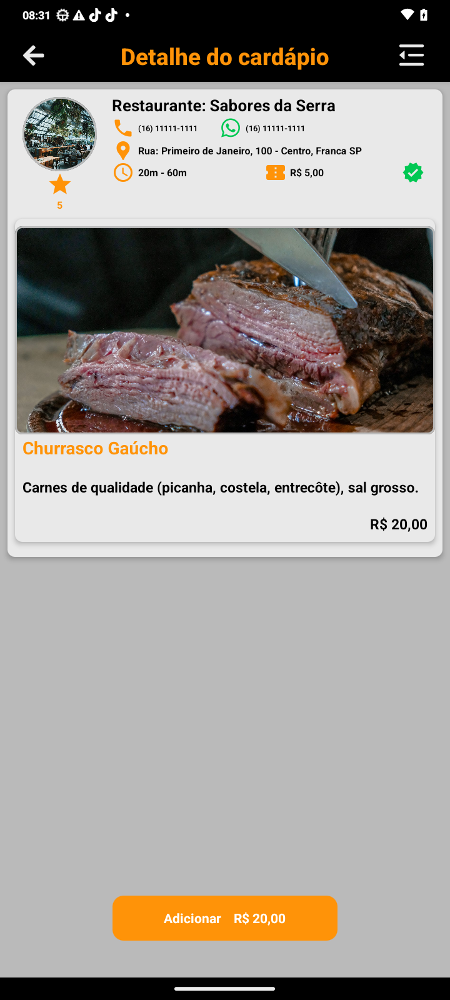
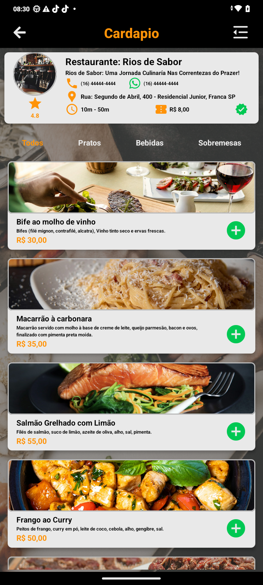
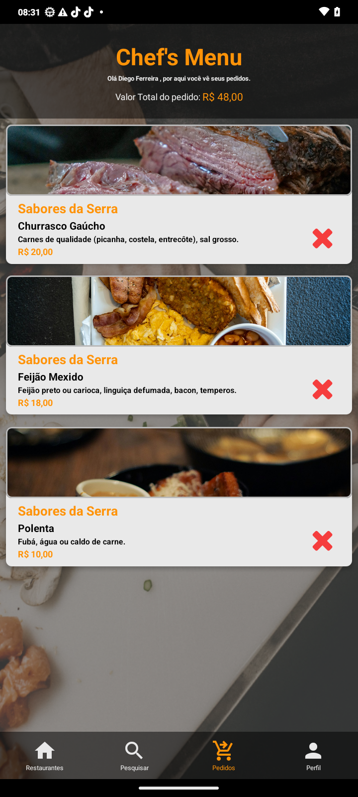
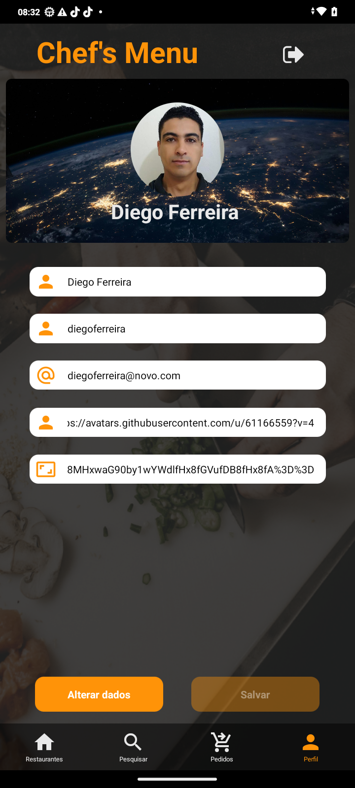

<h1 align="center">Chef's Menu</h1>

  

  <a href="#-sobre">Sobre</a>&nbsp;&nbsp;&nbsp;|&nbsp;&nbsp;&nbsp;
  <a href="#-projeto">Projeto</a>&nbsp;&nbsp;&nbsp;|&nbsp;&nbsp;&nbsp;
  <a href="#-tecnologias">Tecnologias</a>&nbsp;&nbsp;&nbsp;|&nbsp;&nbsp;&nbsp;
  <a href="https://api-restaurant-scxy.onrender.com/documentation/" target="_blank">Documentação Backend</a>&nbsp;&nbsp;&nbsp;|&nbsp;&nbsp;&nbsp;
  <a href="#-proximos passos" target="_blank">Próximos passos</a>&nbsp;&nbsp;&nbsp;|&nbsp;&nbsp;&nbsp;
  <a href="#-autor">Autor</a>

## ✨ Sobre

Projeto desenvolvido para estudo e pratica para Full Stack.

Informações do projeto:

- Um portal WEB responsivo e aplicativo mobile;
- Autenticação por e-mail e senha criptografados;
- Tela inicial com uma lista dos restaurantes;
- A tela possui um campo de busca livre, que filtra os restaurantes cujo NOME DO RESTAURANTE, NOME E DESCRIÇÃO DO PRATO possuam os caracteres digitados;
- Ao clicar em um restaurante na lista, a plataforma leva para a tela de detalhe do restaurante e cardápio;
- Tela com detalhe do restaurante, mostrando nome, telefone e endereço, além da lista de itens do cardápio (nome, descrição e preço)

Para teste já possui:

- Usuario "teste@teste.com.br e senha "123Teste"; 
- Backend respondendo a chamadas API REST; 
- Repositório de dados contendo informações dos usuários, restaurantes e itens do cardápio;

## ✨ Projeto
<!-- 

  

 -->

<h3 align="center">O projeto foi desenvolvido usando a MERN STACK, abreviação para MongoDB, Express, React, e Node.js</h3>

  

### Banco de dados

 

Foi utilizado o Mongo Atlas, que alem de ser o banco MongoDB ele já fica em nuvem, facilitando acesso ao mesmo.

### Backend

 

- <a href="https://github.com/diegohfcelestino/chefs-menu/tree/main/api-restaurante" target="_blank">Backend</a>
  
O backend foi desenvolvido utilizando NodeJS, Express e o JWT para proteção de rotas. O projeto foi publicado no Rende, plataforma para fazer deploy com Node e nele possui as seguintes requisições/end points:

- Criar usuário, alterar, buscar todos os usuário e buscar um usuário por ID.
- Autenticação,
- Cadastrar restaurante e buscar todos os restaurantes.
- Cadastrar cardápio vinculando um restaurante, buscar todos os cardápios, buscar cardápio por ID.
- Pesquisa dinamica de cardápio, por nome do restaurante, por nome do prato e descrição do prato.
- Buscar os cardápios por ID de um restaurante e apagar cardapios.

Foi criada a documentação de todos os end points utilizando o Swagger, para ter acesso, basta clicar <a href="https://api-restaurant-scxy.onrender.com/documentation/" target="_blank">aqui</a>, ou copiar o link `https://api-restaurant-scxy.onrender.com/documentation/` e colar em seu navegador.

### Mobile

   

- <a href="https://github.com/diegohfcelestino/chefs-menu/tree/main/app_restaurante" target="_blank">Mobile</a>

O aplicativo foi desenvolvido utilizando React-native, utilizado vector-icons para trabalhar com icones, crypto-js para proteger os dados, async-storage para login automático quando usuário salvar e navegação de telas com o native-stack.

#### Telas e funcionalidades do aplicativo

- Tela inicial com apresentação do app.
- Cadastrar usuario.
- Login com autenticação criptografada com a possibilidade do usuário salvar senha e entrar de forma automática.
- Primeira tela do aplicativo traz todos os restaurantes cadastrados por ordem crescente de distancia.
- Ao clicar no banner do restaurante a tela é direcionada para o cardápio.
- Na tela do cardápio traz as informações de todos os prato, bebidas e sobremesas, com a possibilidade de entra no item ou adicionar no pedido.
- Detalhe do cardápio, tras todas as informações do item e pode adicionar ao pedido.
- Nas telas de cardápio e detalhe do cardápio, foi adicionado um menu lateral a direita, para facilitar a navegação.
- Na tela de pesquisa ao entrar ela traz todos os restaurantes cadastrados, com a possibilidade de pesquisar.
- Pedidos, nessa tela figa gravados os pedidos, podendo navegar até a tela de detalhe do item ou excluir o item do cardápio.
- Os pedidos ficam salvos no storage do celular.
- Tela de perfil, tras os dados do usuário e podem ser alterados também.
- Foi utilizado o storage para salvar informações do usuário com email criptografado e token também.
- Abaixo estão as telas do aplicativo.

## 🧪 Tecnologias

- <a href="https://nodejs.org/en/" target="_blank">Node</a>
- <a href="https://expressjs.com/pt-br/" target="_blank">Express</a>
- <a href="https://reactnative.dev/" target="_blank">React-native</a>
- <a href="https://www.javascript.com/" target="_blank">Javascript</a>
- <a href="https://www.mongodb.com/" target="_blank">MongoDB</a>
- <a href="https://www.md5hashgenerator.com/" target="_blank">MD5</a>
- <a href="https://jwt.io/" target="_blank">JWT</a>
- <a href="https://axios-http.com/ptbr/docs/intro" target="_blank">Axios</a>
- <a href="https://dashboard.render.com/" target="_blank">Render</a>
  

## ✨ Próximos passos

Para o aplicativo
- Adicionar tela de fechamento de pedidos/pagamentos.
- Adicionar leitura de cartão de crédito via NFC.
- Concluir pedido e solicitação do mesmo.
- Acompanhar entrega do item.

Criar projeto Web para o logista.

- Acompanhar pedidos solicitados.
- Aprovar pedido e já começar a produção do mesmo.
- Finalizar produção e chamar o entregador/finalizar pedido.

### O projeto pode ser clonado e executado localmente.

## ✨ Autor

Feito com amor por **Diego Henrique Ferreira Celestino**.
Entre em contato!

